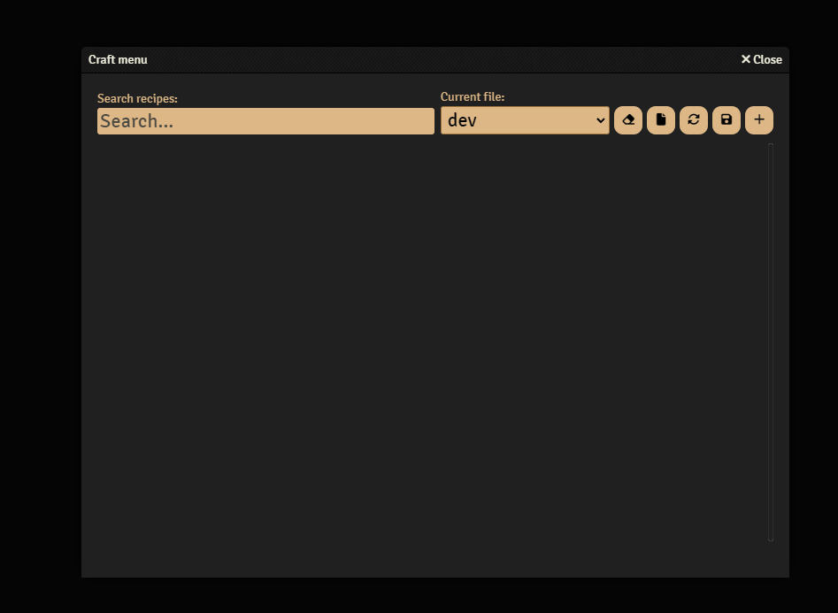
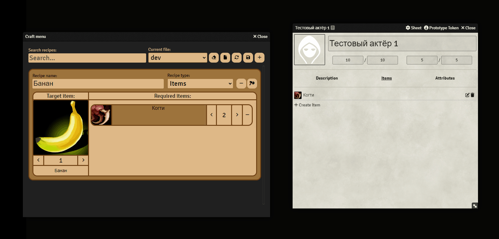
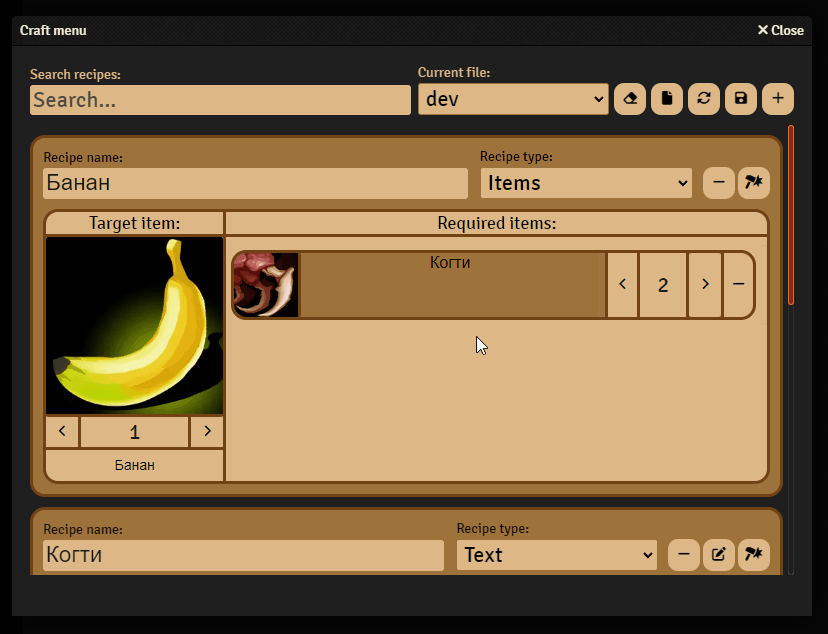
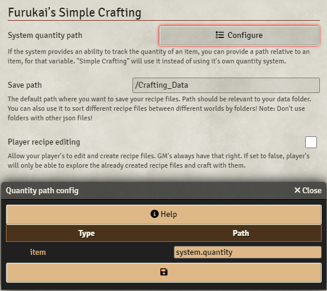

# Furukai's Simple Crafting

*A Foundry VTT system independent module that provides a simple way to create crafting recipes and to craft items from them.*

## Installation
    TODO
## About

This module allows you to create 2 types of recipes(currently):
- Text type recipes, which are just an item with any custom text you provide. It is craftable for free.
- Items type recipes, which require players to have all the necessary item's in their inventory, to craft with.

### How to use
To open the craft menu you need to click the hammer button here:

The craft menu interface is easy to work with. Every button has a tooltip with a little description of what this button does.

When crafting an item, module check actors inventory and if there is enough ingredient's it allows you to craft, automatically using all the ingredients necessary. If you use the "Quantity path" setting(more info below), you can also integrate system's quantity value of the item with the module, allowing to check and modify it.

### Search
The craft menu has a simple search system, that allow's you to find recipe's by their:
- names
- target item names
- image names
- ingredient's name
- description

### Settings
Currently there are 3 available settings.

#### System quantity path
A simple menu which contains all the item types provided by your system of choice, and a text fields where you can write the path to the quantity variable of that item. There's also a handy instruction on how you can obtain that path.

#### Save path
All your recipes are saved as .json files. This setting help's you to sort them by folders.

#### Player recipe editing
This setting allow's you to permit your player's to create their own recipes. They will only be able to work with file's in the folder you provided in the "Save path" setting.

## Plans and ideas for the future
- Adding support to use recipe file's in different worlds with the same system
- Adding more recipe types
- Secret recipes that need's to be unlocked
- And more!

## Contributions
This project is in the active development. Contributions and pull request's are welcome!

If you have found a bug or have a suggestion/feature request you can open an issue [here](https://github.com/Furukia/furu-sc/issues).
You can also contact me on Discord: furukai

### Languages
Simple Crafting currently supports this languages:
- English
- Russian

If you want to translate this module to your own language, feel free to open a pull request!
